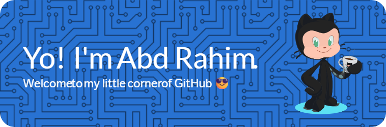

# <div align="center">👨‍💻 Idhul Rahman | Cybersecurity & AI Enthusiast</div>

<div align="center">
  
</div>

<br/>

## <div align="center">🚀 About Me</div>

<p align="center">
  
</p>

```python
class IdhulRahman:
    def __init__(self):
        self.name = "Idhul Rahman"
        self.education = "Telecommunication Engineering"
        self.interests = ["Cybersecurity", "Data Science", "Artificial Intelligence"]
        self.current_focus = ["Security Labs", "Threat Simulation", "ML Solutions"]
        self.skills = {
            "blue_team": ["Vulnerability Assessment", "Incident Response", "Security Monitoring"],
            "data_science": ["Predictive Analytics", "Anomaly Detection", "ML Algorithms"],
            "coding": ["Python", "R", "Automation Scripting"]
        }
    
    def say_hi(self):
        print("Thanks for dropping by! Let's connect and build something amazing together.")

me = IdhulRahman()
me.say_hi()
```

<br/>

## <div align="center">🛠️ Tech Stack</div>

<div align="center">
  
  
  
  
  
  
  
  
</div>

<br/>

## <div align="center">🔍 Current Focus</div>

<div align="center">
  <table>
    <tr>
      <td align="center" width="33%">
        
        <br />
        Building custom security labs and implementing threat detection systems
      </td>
      <td align="center" width="33%">
        
        <br />
        Developing predictive models for network anomaly detection
      </td>
      <td align="center" width="33%">
        
        <br />
        Exploring AI applications in security automation
      </td>
    </tr>
  </table>
</div>

<br/>

## <div align="center">📊 GitHub Stats</div>

<div align="center">
  
  
</div>

<div align="center">
  
</div>

<br/>

<div align="center">
  
</div>

<br/>

## <div align="center">🔗 Connect With Me</div>

<div align="center">
  <a href="https://www.linkedin.com/in/idhulrahim">
    
  </a>
  <a href="https://instagram.com/idhulrahim">
    
  </a>
  <a href="mailto:idhulrahim@gmail.com">
    
  </a>
</div>

<br/>

<div align="center">
  
</div>

<div align="center">
  
  
  
</div>

---

<div align="center">
  <i>"The best way to predict the future is to create it."</i>
</div>
